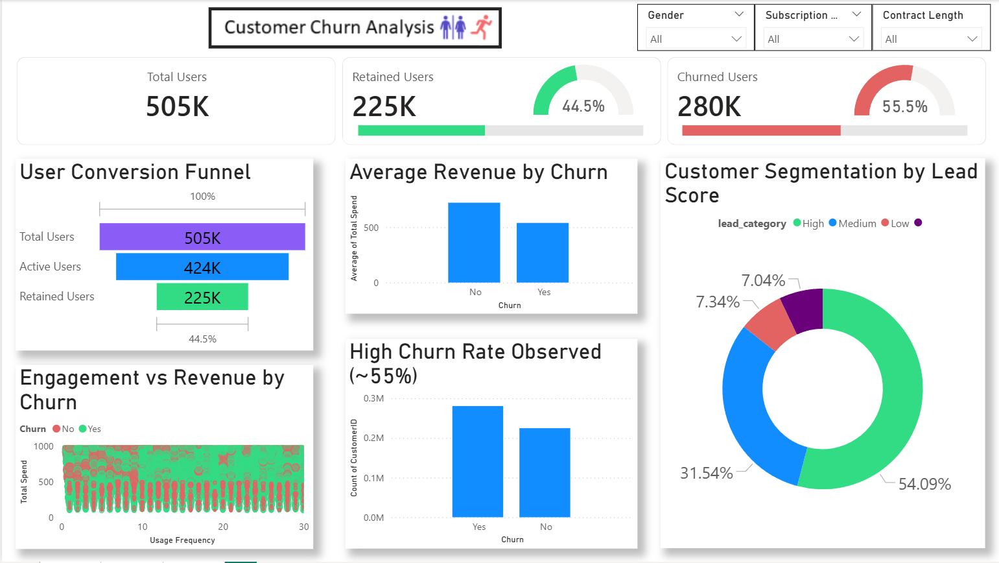
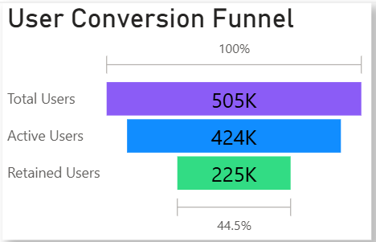

# 📊 Customer Churn & Revenue Insights Dashboard

## 📌 Project Overview

This project focuses on analyzing customer churn behavior and identifying key factors influencing user retention, engagement, and revenue generation. Using data analysis and visualization techniques, the project uncovers actionable insights to support business decision-making and pipeline growth.

---

## 🎯 Objective

* Analyze customer churn patterns
* Identify key drivers of retention and revenue
* Segment users based on engagement and value
* Provide actionable insights for improving customer lifecycle and growth

---

## 🛠️ Tools & Technologies

* Python (Pandas, NumPy, Seaborn, Matplotlib)
* Google Colab
* Power BI

---

## 📂 Dataset

Due to size constraints, datasets are not uploaded in this repository.

* 📥 Original Dataset (Kaggle):
  [[Kaggle](https://www.kaggle.com/datasets/muhammadshahidazeem/customer-churn-dataset)]

* 📊 Processed Dataset:
  A cleaned and feature-engineered dataset (`final_analysis.csv`) was created in Google Colab, including:

  * Handling missing values
  * Feature engineering (lead score, segmentation)
  * Data transformation for analysis

---

## 📈 Dashboard Preview

### 🔹 Full Dashboard

### 🔹 User Conversion Funnel

---

## 📊 Key Insights

* High churn rate (~55%) indicates significant retention challenges
* High-value users (higher total spend) are more likely to be retained
* Engagement alone does not guarantee retention — value realization is critical
* Significant drop-off occurs after user activation stage
* High lead score users represent strong upsell opportunities

---

## 📊 Dashboard Features

* KPI Metrics (Total Users, Retained Users, Churned Users)
* User Conversion Funnel (Total → Active → Retained)
* Churn Distribution Analysis
* Revenue vs Churn Comparison
* Engagement vs Revenue Scatter Plot (Customer-level analysis)
* Customer Segmentation based on Lead Score
* Interactive Filters (Subscription Type, Contract Length, Gender)

---

## 🔗 Project Links

* 📓 Google Colab Notebook:
  [[Colab link](https://colab.research.google.com/drive/1rmGJ_FuCUT6YbJLsz59l7Q2qtX5q5GI9?usp=sharing)]

* 📊 Power BI Dashboard:
  

---

## 💼 Business Impact

This analysis helps:

* Identify high-risk churn segments
* Improve customer retention strategies
* Target high-value users for upselling
* Support data-driven decision-making in product and RevOps teams

---

## 🚀 Future Improvements

* Build predictive churn model (Machine Learning)
* Deploy dashboard using Power BI Service
* Automate data pipeline for real-time insights

---

## 👤 Author

Gaurav Sharma
